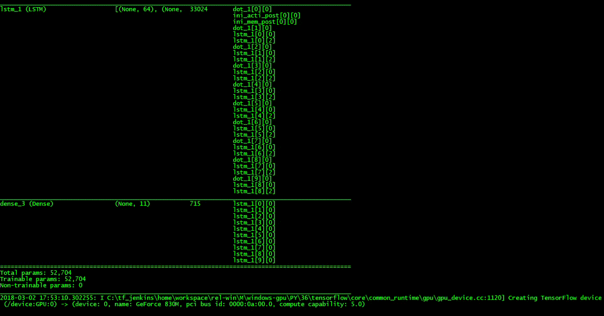

# Neural Date Translation

Date translation from conventional Human readable format to machine readable format(YYYY-MM-DD) using Neural Machine Translation.
For example a date in human readable format can be : 'sunday 15 september 2013', '29-oct-1997' or '30 august 1985' etc. 
The task is to convert this to a more normalized format like **YYYY-MM-DD**.

For this task a **sequence to sequence encoder-decoder** network has been used. LSTM cell units  have been used in both the encoder as well as the decoder network.
This model also use **Attention Mechanism**.

There are three main files:
1. **Neural Date Translation (Jupyter Notebook)** : Contains the main code along with explanation. Also this is to be used is retraining is required.
2. **Neural Date Translation (Python script)** : Incase you just want to see this in action. This doesn't train the model instead uses the saved weight values.
3. **utility** : used for generating and preprocessing training data.

### <u>Credits:
This project is based on the assignment from Sequence Models Specialization by Deeplearning.ai on Coursera.  https://www.coursera.org/learn/nlp-sequence-models/home/welcome
